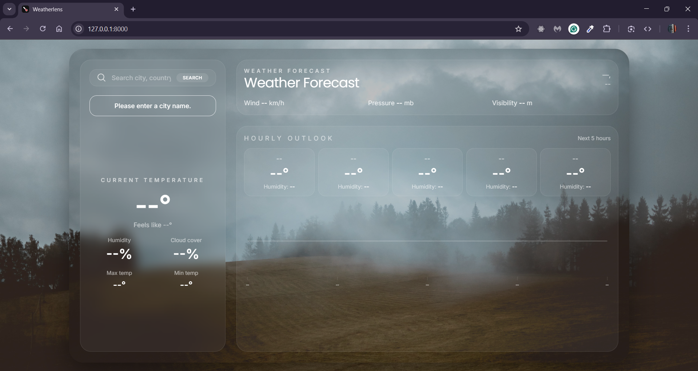
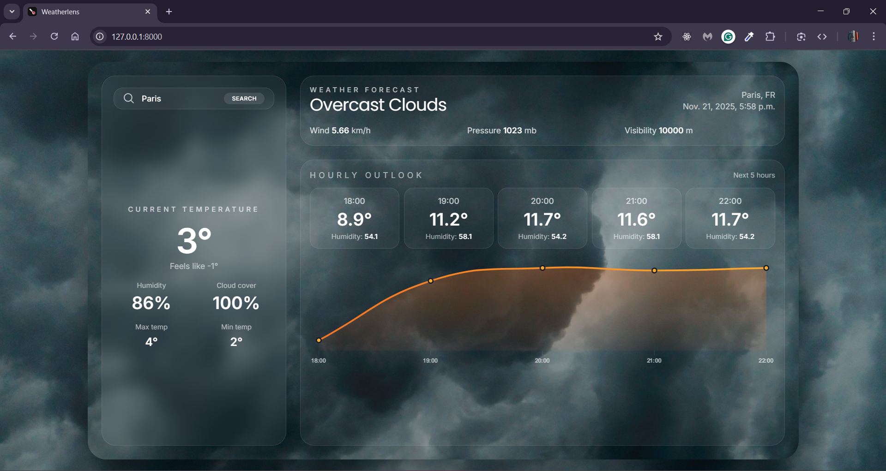

# Weather Prediction Forecasting

Weatherlens is an end‑to‑end workflow built around a multi-model forecasting pipeline: engineered features feed tree-based regressors for temperature and humidity, an autoregressive component stabilizes barometric pressure trends, and the orchestrated outputs are serialized for real-time serving through Django. The stack emphasizes reproducible preprocessing, deterministic training, and predictable inference handoffs.

## Data & Feature Engineering
- Multi-year hourly measurements from `weather.csv` include temperature, humidity, pressure, wind, cloud cover, and visibility.
- pandas and numpy handle ingestion, timezone normalization, and datatype coercion.
- Short gaps are forward-filled, longer outages use median backstops, and pressure/wind derivatives are clipped to realistic bounds.
- Temporal signals rely on sine/cosine encodings for hour-of-day and day-of-year, complemented with lagged differentials for momentum.
- Feature groups are z-score normalized, and categorical weather codes receive one-hot encoding.

## Modeling Architecture
- A multi-output scikit-learn `RandomForestRegressor` keeps min, max, and feels-like temperatures correlated.
- A `GradientBoostingRegressor` targets humidity and cloud cover, leveraging shallow depth to curb overfitting on noisy signals.
- A statsmodels ARIMA residual layer captures slow barometric drift and feeds corrections back into the ensemble.
- Model outputs are blended with weights tuned on validation MAE, and uncertainty estimates stem from Random Forest variance statistics.
- All fitted estimators and preprocessing pipelines are persisted with joblib for downstream reuse.

## Evaluation Strategy
- Rolling-origin train/validation splits advance 24 hours per fold to respect chronology.
- Metrics include MAE, RMSE, MASE versus climatology, and Pearson correlation for humidity trajectories.
- seaborn and matplotlib provide diagnostics for feature importance, residual shape, and forecast-vs-observation comparisons.
- statsmodels `acf`/`pacf` guide lag selection and confirm residual autocorrelation remains within confidence bounds.

## Serving & Integration
- The Django app `WeatherLens/forecast` remains lightweight: it loads the serialized pipelines once and keeps them warm for low-latency inference.
- Notebook preprocessing steps are mirrored inside the view so requests traverse the same transformations before prediction.
- SI units are converted, strings formatted, and structured context passed into `weather.html`; front-end JavaScript is limited to rendering the five-hour chart.

## Repro / Local Execution
- Create the environment and install dependencies: `pip install -r requirements.txt`.
- Open the notebook to retrain or tweak models, then export fresh joblib artifacts to the paths consumed by `forecast/views.py`.
- Launch the Django server with `python WeatherLens/manage.py runserver` to validate end-to-end behavior.
- Optionally extend `weather.csv`; notebook guidance shows how to append new data slices without compromising historical splits.

## Interface Preview
-  Empty-state panel confirming the Django layer is live, highlighting the search entry point, and showing placeholders awaiting metrics.

-  Populated view demonstrating how the Random Forest + Gradient Boost + ARIMA ensemble surfaces headline weather, KPI blocks, and a five-hour temperature trajectory directly from the trained pipelines.
